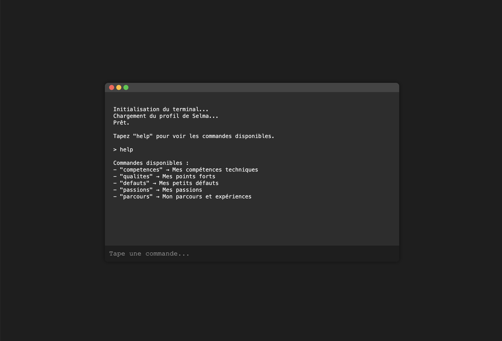

# 💻 Terminal Interactif

Un petit terminal en ligne de commande codé en HTML, CSS et JavaScript, conçu pour offrir une expérience originale et interactive.

---

## 🎯 Objectif

Créer une interface immersive inspirée des vrais terminaux pour présenter du contenu (profil, parcours, compétences...) sous forme de commandes.

---

## ✨ Fonctionnalités

- Interface responsive avec look "terminal"
- Barre de commande avec champs d'entrée utilisateur
- Système de réponse dynamique basé sur des commandes personnalisées
- Animation de clignotement du curseur (`caret`) simulée
- Icônes colorées de fermeture/minimisation (style macOS)
- Design dark mode by default

---

## 🧩 Commandes disponibles

Exemples de commandes (personnalisables dans `script.js`) :
```
help
parcours
competences
qualites
defauts
passions
```

Chaque commande déclenche une réponse personnalisée dans l'affichage du terminal.

---

## 🛠 Technologies

- HTML5
- CSS3 (responsive + animations)
- JavaScript (DOM, `addEventListener`, `setTimeout`, logique interactive)

---

## 📁 Fichiers

```
/index.html       ← structure principale
/style.css        ← apparence du terminal
/script.js        ← logique et commandes
```

---

## 🚀 Aperçu

 *(à remplacer par ta vraie capture si besoin)*

---

## 🔧 Personnalisation

Tu peux ajouter ou modifier les commandes dans `script.js`, à l'intérieur de l’objet `responses` :

```js
const responses = {
  help: "Commandes disponibles : ...",
  parcours: "Mon parcours : ...",
  ...
}
```

---

## 👩‍💻 À propos

Ce projet est une mini-expérience utilisateur intégrée à mon portfolio, pensée pour être à la fois technique, originale et engageante.

> Développé par **Selma Gosset-Petelet**
